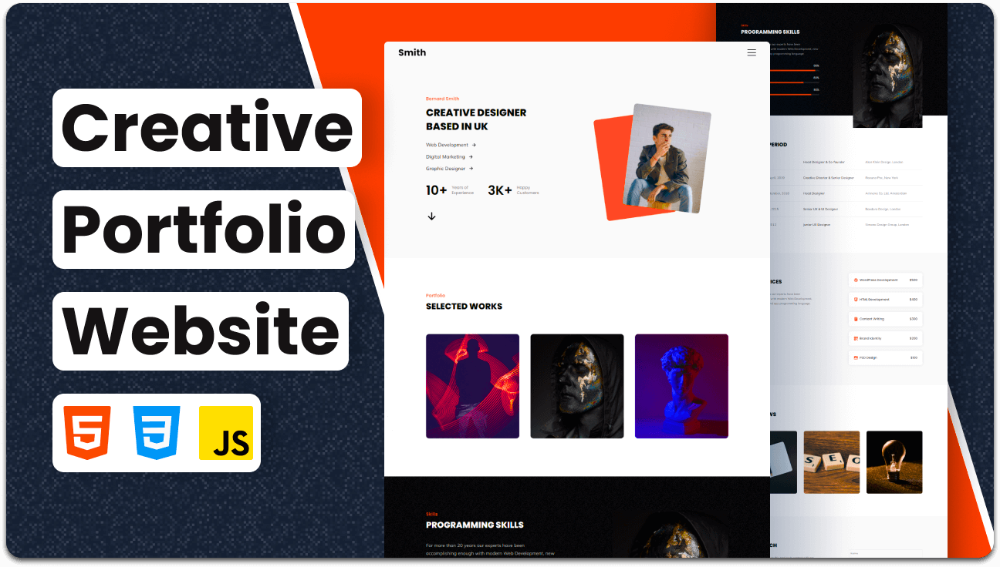

 

## 💼 Portfolio Website  
A sleek and modern **Personal Portfolio Website** built using HTML, CSS, and JS.  
It showcases your skills, projects, and experience with a clean and professional design that leaves a lasting impression.

 

<!-- ABOUT THE PROJECT -->
## 📖 About The Project

**Portfolio Website** is a personal digital showcase that highlights your professional identity.  
It includes sections for **About**, **Skills**, **Projects**, **Experience**, and **Contact**, all structured for clarity and modern presentation.  
Perfect for **developers, designers, and freelancers** looking to build a strong online presence and impress potential clients or employers.

---

### ✨ Features

- Fully responsive and mobile-friendly layout  
- Smooth scrolling and section-based navigation  
- Clean, elegant design with subtle animations  
- Separate sections for About, Skills, Projects, and Contact  
- Easy to customize content and color palette  

---

### 🛠️ Built With

* [HTML5](https://html5.org/)  
* [CSS3](https://developer.mozilla.org/en-US/docs/Web/CSS)  
* [JavaScript](https://developer.mozilla.org/en-US/docs/Web/JavaScript)

---

## 📬 Contact

**LinkedIn** – [Muhammad Salman Arshad](https://www.linkedin.com/in/muhammad-salmanarshad/)  
**Email** – [msalmanwebdev@gmail.com](mailto:msalmanwebdev@gmail.com)

(<a href="#top">back to top</a>)

