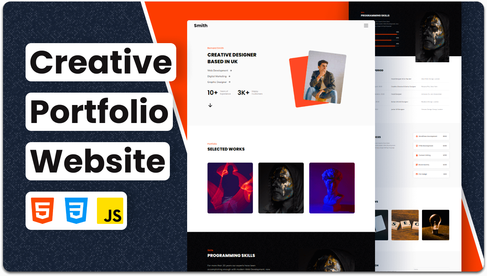

 

<!-- 🔰 BADGES -->

 

<!-- 🔰 PROJECT LOGO -->

 
 

<h1 align="center">💼 Portfolio Website</h1>

A sleek, modern, and fully responsive  
**Personal Portfolio Website** built using **HTML, CSS, and JavaScript**.

<a href="https://portfolio2-website-mu.vercel.app/"><strong>➥ Live Demo</strong></a>

---

<!-- TABLE OF CONTENTS -->

  
📑 Table of Contents

  <ol>
    <li><a href="#about-the-project">About The Project</a></li>
    <li><a href="#features">Features</a></li>
    <li><a href="#built-with">Built With</a></li>
    <li><a href="#contact">Contact</a></li>
  </ol>

---

## 📖 About The Project

The **Portfolio Website** is a modern personal digital showcase designed to present professional skills, projects, experience, and personal information in a clean and engaging way.

The layout focuses on:
- Modern and professional portfolio design
- Clear presentation of skills and projects
- Smooth section-based navigation
- Responsive layouts across all devices
- Clean typography, spacing, and visual hierarchy

This project demonstrates your ability to build **professional personal branding websites**, organize information effectively, and create responsive interfaces that provide a polished user experience.

Ideal for:
- Developer and designer portfolios
- Freelancer personal websites
- Job application portfolios
- Personal branding websites
- Front-end UI and responsive design practice

---

## ✨ Features

- Fully responsive portfolio layout
- Clean and modern personal branding UI
- About, Skills, Projects, Experience, and Contact sections
- Smooth scrolling navigation
- Subtle animations and hover effects
- Professional typography and spacing
- Easy to customize content and color palette

---

## 🛠️ Built With

This project is built using:

- **HTML5**
- **CSS3**
- **JavaScript (Vanilla)**

---

## 📬 Contact

**Muhammad Salman Arshad**

- 💼 **LinkedIn:** https://www.linkedin.com/in/muhammad-salmanarshad/
- 🎨 **Figma:** https://www.figma.com/@codewithsalman
- 📧 **Email:** [msalmanwebdev@gmail.com](mailto:msalmanwebdev@gmail.com)

(<a href="#top">back to top</a>)

